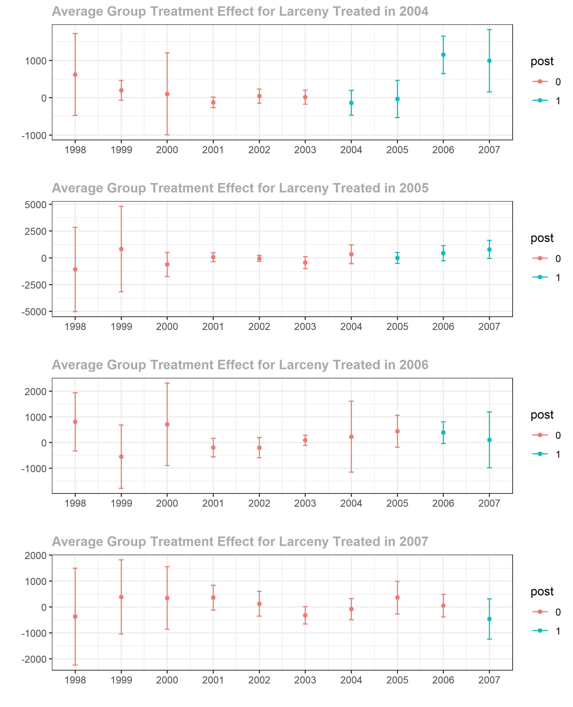
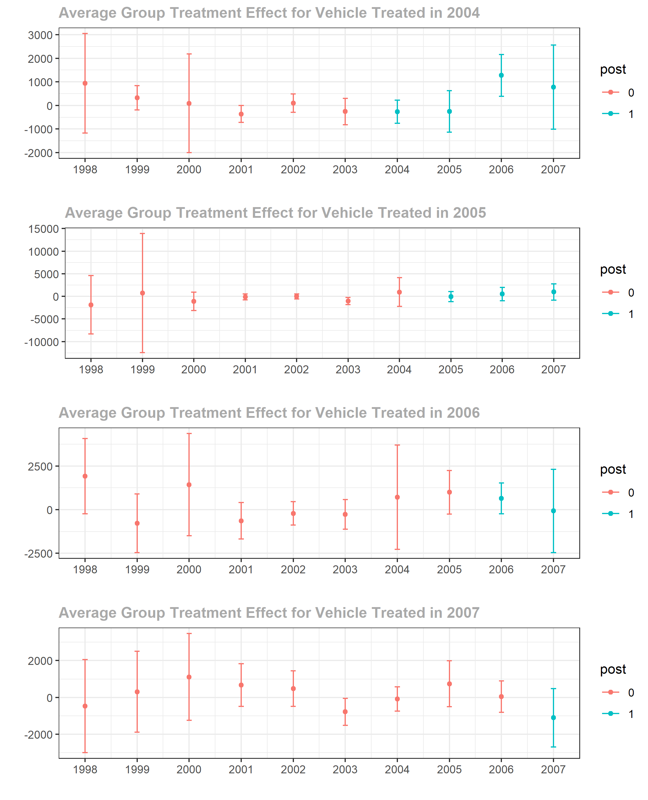
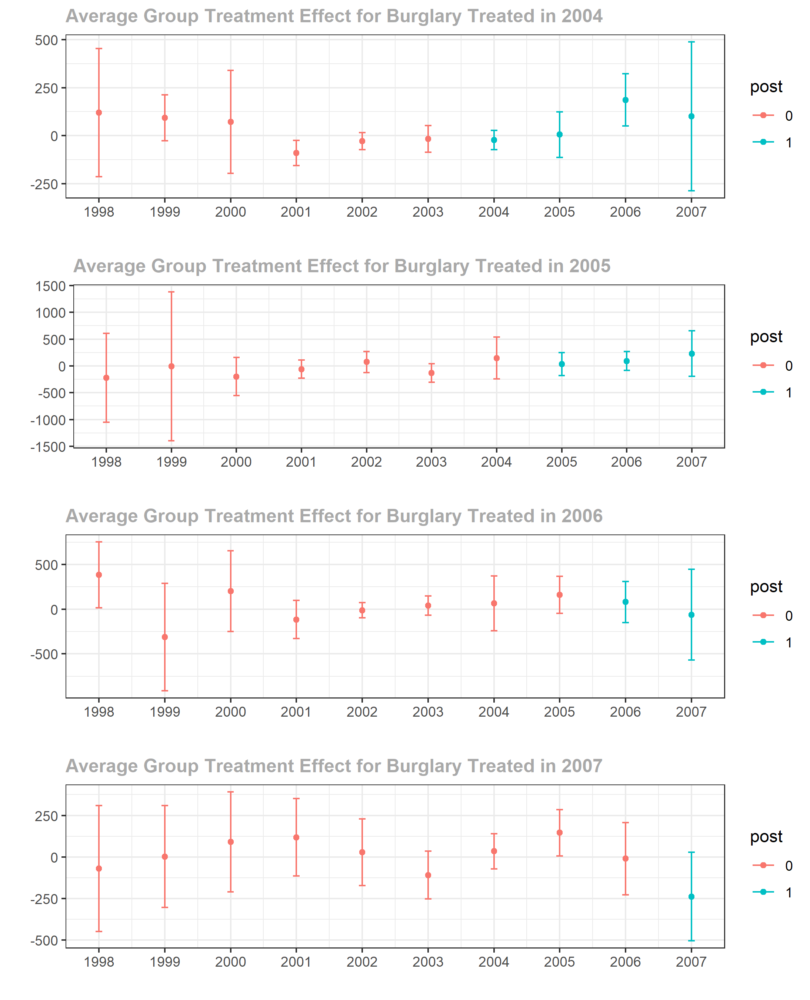
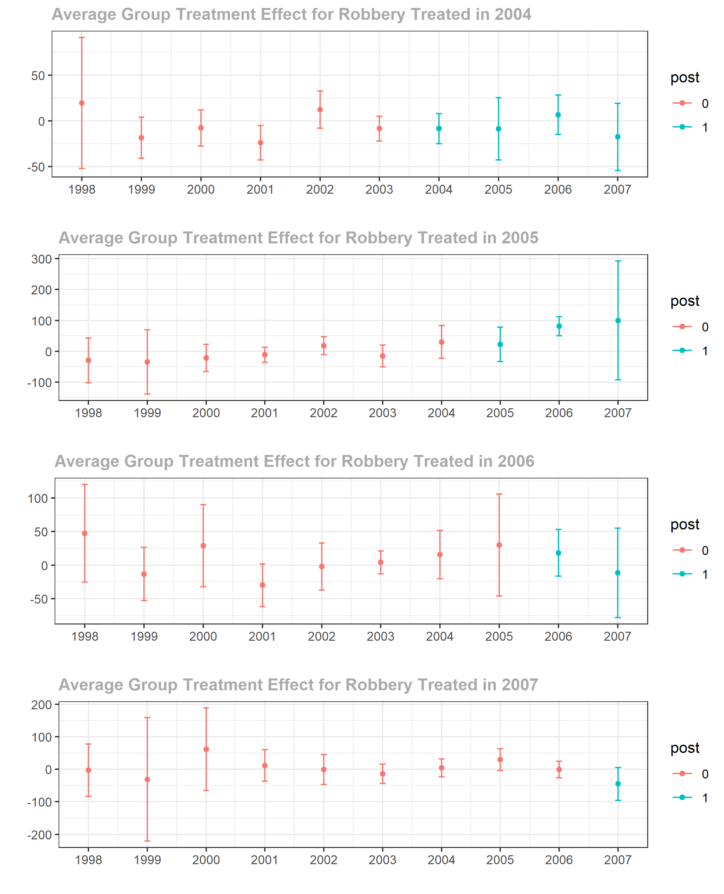

```{r setup, include=FALSE, message=FALSE}
knitr::opts_chunk$set(echo = FALSE, warning = FALSE,message=FALSE)
library(did)
library(haven)
library(dplyr)
library(tidyverse)
library(zoo)
library(lubridate)
library(stats)
library(collapse)
library(xlsx)
library(kableExtra)
library(readxl)
```

## Describing the Data and Methodology

 

```{r, echo=FALSE, include=FALSE}
# This is the preparation file that imports the cleaned and reduced version of all the datasets, using Stata, of my data 
 ucr_meth <- read_dta("G:/Causal Inference/Data/ucr_meth.dta")
# ucr_meth <- read_dta("C:/Users/gaeta/Documents/GitHub/CausalReasearch/ucr_meth.dta")

UCR <- zap_formats(ucr_meth) #
UCR<- zap_label(UCR) # Need to zap stuff because my data set does not play nice with R

# Dropping the states that were dropped
remove <- c("AL", "AK", "AZ", "AR", "CA", "CT", "DC","DE", "HI", "ME", "MA", "MS", "NH", "NJ", "NY", "OR", "PA", "RI", "VT", "WA", "WY", "KY")
UCR <- UCR[!UCR$stname %in% remove,]
UCR <- UCR[complete.cases(UCR), ] # dropping varables without a name or stateip

UCRQuarter <- UCR %>%
  mutate(Quarter = ceiling(as.numeric(UCR$month) / 3)) # Specifying which quarter the data belongs in accroding to the month

UCRTEST <- collapse::collap(UCRQuarter, ~ stname + year + Quarter) # Aggregating by the state name, the year and quarter 

 write.xlsx(UCRTEST, file = "G:/Causal Inference/Data/CleanUP1.xlsx") # Exporting the data as an excel spreadsheet so that I can mually add in the First.Treat and treat columns 
# write.xlsx(UCRTEST, file = "C:/Users/gaeta/Documents/GitHub/CausalReasearch/CleanUP1.xlsx")


# Read in the modified excel spreadsheet
 CleanUP <- read_excel("G:/Causal Inference/Data/CleanUP.xlsx")
# CleanUP <- read_excel("C:/Users/gaeta/Documents/GitHub/CausalReasearch/CleanUP.xlsx")

CleanUPWork <- collap(CleanUP, ~ stname + year, custom = list(fmean= 22, fmean= 1, fsum = 4:21, fsum = 23)) # Collapse data where we are taking the mean of column 1 and 22, representing state id and year, and summing the rest of the rows 

CleanUPWork$treated <- ifelse(CleanUPWork$treated>1,1,0) # need to round the treated column down to 1 if greater than 1 as we want it to be a binary.
```

Calls to increase the minimum to $15 an hour has featured prominently in recent policy debates in the United States at every level: federal, state, and even local. Even though nearly three decades have passed since Card and Krueger’s “Minimum Wages and Employment” paper in 1994, there is surprisingly a large controversial literature on the effects of minimum wage increases on overall employment.  Some researchers have only focused on the impact on teen employment (Card 1992; Allegretto et al. 2017, Callaway and Sant’Anna 2020), whereas others focus solely on specific sectors. Furthermore, there is very little research about the effects of increases of the minimum wage on overall crime rates, and whether there is a direct causal effect of these increases on the overall crime. Even in the literature concerning minimum wage increases and overall crime there is some controversy. For example, Hashimoto (1987) managed to estimate a time series regression and found that increase in the federal minimum wage are positively correlated to property crimes for teenagers. This is supported by Beauchamp and Chan (2014) who also find evidence that the increase to minimum wage leads to an increase in property and violent crimes caused by teenagers, but on the other hand, decrease for young adults. This paper seeks to make contributions to the existing literature on minimum wage by using the Federal Bureau of Investigation’s Uniform Crime Reporting program (UCR) and new research method developed by Callaway and Sant’Anna (2020). 

For this paper, the primary data source for my crime analysis is the UCR and information provided by Callaway and Sant’Anna (2020), namely the 29 states that I will be using. The UCR allows me to generate criminal arrest rates from 1997 to 2007 by county  and by year. The UCR collects the number of offenses that have come to the attention of law enforcement for violent and property crimes, as well as data concerning clearances of these offenses, which I will not be using. Violent crimes are defined by the FBI as offenses that involve force or the threat of force, whereas property crimes are offenses that do not involve force or the threat of force. The offenses that I will be paying particular attention to are murder, manslaughter, rape, robbery, burglary, larceny and vehicle theft.
	
I decided to not include aggravated assaults and arson offenses as they either redundant, as it is the case for aggravated assaults, or there is a limited amount of data, as it is the case for arson. I deem that aggravated assaults are redundant with robbery because the FBI clearly states that when aggravated assault and larceny occur together the offense should be considered as robbery. However, once could argue that I should also not include the rest of the violent crimes, except for robbery, because these are non-financially motivated crimes. I argue that these crimes should be included as there a might be a significant correlation, and possibly causation, between financially motivated and non-financially motivated crimes. Unlike the clear statement from the FBI’s UCR page concerning the distinction between aggravated assault and larceny, there is no evidence to suggest that police report a theft and murder as either a murder or a theft crime allowing for the possibility for the same crime to be reported “twice”, one for each offense. Since it is conceivable that there might be cases where robberies lead to offenses of manslaughter or murder, in what I refer to as an escalation of crime, it is possible that these non-financially motivated crimes might be indirectly impacted by changes to the minimum wage.   


In order to perform my analysis, I am using the same method as Callaway and Sant’Anna (2020) called the difference-in-difference with multiple time periods, rather than the regular difference-in-difference (DID). As I am considering a time period from 1997 to 2007, a period where the federal minimum wage had remained at $5.15 an hour, there have been some states that increased their minimum wage throughout this period, thus becoming part of the treated group, whereas others have kept their minimum wage at the federal minimum, these are considered as the untreated group. The states that have not changed their minimum wages during this time period, but had their minimum wages higher than the federal minimum wage have been dropped. This leaves me with a total of 29 states. The only major methodological difference between my paper and Callaway and Sant’Anna’s is that they focus on county level teen employment, whereas I look at the state level overall crime per capita.  The benefit of using this new research method is that the states that have changed their minimum wage have done so at different timings, thus making a normal two way fixed effect or DID difficult to do. 

A regular DID analysis requires the researcher to setup two time periods and two groups: in the first period no one is treated and then in the second period one group is treated and the other is not. However, since changes in the minimum wage have occurred at different time periods it is difficult to estimate the true causal effect of increasing the minimum wage. In the following sections I will be perform my analysis, comment on my results and explain the limitations of my paper.

 

  

## Performing the Analysis

### Identification

Given that there are different potential outcomes for each state that cannot be observed for the same state at the same time, we need to identify and estimate the causal effect of treatment. 
```{r}
############################## rape
attrape_pc <- att_gt(yname = "rape_pc", # LHS variable
               tname = "year", # time variable
               idname = "statefip", # id variable
               gname = "First.Treat", # first treatment period variable
               data = CleanUPWork, # data
               xformla = NULL, # no covariates
               est_method = "dr", # "dr" is doubly robust. "ipw" is inverse probability weighting. "reg" is regression
               control_group = "nevertreated", # set the comparison group which is either "nevertreated" or "notyettreated" 
               bstrap = TRUE, # if TRUE compute bootstrapped SE
               biters = 1000, # number of bootstrap iterations
               print_details = FALSE,
               clustervars = "statefip", # cluster level
               panel = TRUE) # whether the data is panel or repeated cross-sectional

```
```{r, , out.height = '80%', fig.align='center'}
# Plot group-time ATTs
knitr::include_graphics("attrape_pc.png")

```

As we can see in the above graph, there is no statistically significant effect of minimum wage increase on the number of rapes per capita. In fact, there is no statistically significant effect on any of the violent non-financial crimes. These results are rather unsurprising as these types of crimes are usually motivated by the willingness to cause harm, as is the case for murder, rape, and manslaughter (i.e. a bar fight gone badly). Since changes in the minimum wage might financially affect criminals, the only way for non-financial crimes to be affected is if there is a significant percentage of these that are explained by “escalation of crimes.” For example, if a criminal is mugging a couple, thus committing robbery, they fight back and the robber kills the husband, he will be charged with manslaughter, and possibly robbery if the UCR allows for both. In this example, the criminal did not want to kill man as he was simply finically motivated, but the crime escalated into a non-financial crime. If these types of “escalations of crime” made statistically significant part of non-financial crimes, then they would be indirectly affected by changes in the minimum wage, assuming that financially motivated crimes are affected by the changes. However, this is unlikely to be the case as the graphs indicate that there was a statistically significant positive effect of the minimum wage increase on robberies in 2006 for groups that were treated in 2005.  


```{r, fig.align='center'}
# Event-study
agg_effects_es <- aggte(attrape_pc, type = "dynamic", na.rm = TRUE)
rape <- cbind(c(round(agg_effects_es$overall.att, digits = 3), "(-9.37, 2.67)"))

```

```{r}

############################## larceny
attlarceny_pc <- att_gt(yname = "larceny_pc", # LHS variable
                  tname = "year", # time variable
                  idname = "statefip", # id variable
                  gname = "First.Treat", # first treatment period variable
                  data = CleanUPWork, # data
                  xformla = NULL, # no covariates
                  #xformla = ~ l_police, # with covariates
                  est_method = "dr", # "dr" is doubly robust. "ipw" is inverse probability weighting. "reg" is regression
                  control_group = "nevertreated", # set the comparison group which is either "nevertreated" or "notyettreated" 
                  bstrap = TRUE, # if TRUE compute bootstrapped SE
                  biters = 1000, # number of bootstrap iterations
                  print_details = FALSE,
                  clustervars = "statefip", # cluster level
                  panel = TRUE) # whether the data is panel or repeated cross-sectional

```

```{r, out.height = '80%' , fig.align='center'}
# Plot group-time ATTs


```


```{r, out.height = '80%' , fig.align='center'}
# Plot group-time ATTs


```

```{r, out.height = '80%' , fig.align='center'}
# Plot group-time ATTs


```

```{r, out.height = '80%' , fig.align='center'}
# Plot group-time ATTs


```

In contrast to the lack of effects on non-financially motivated crimes, there is some evidence of positive effects of the minimum wage on financially motivated crimes. As we can see from the various graphs below, larceny has two group-time average treatment effects that are statistically different from 0, whereas vehicle theft, burglary and robbery have one.  These results are very interesting because they seem to suggest that financially motivated crimes are largely unaffected by change in the minimum wage, thus neither supporting nor denying the argument that changes to the minimum will greatly increase crime, due to teen idleness, or decrease crime, due to an increase in opportunity costs. However, to confirm the evidence, we would need to aggregate the group-time average treatment effects. The results can be seen in table below.   


```{r}
# Event-study you want this 
agg_effects_es1 <- aggte(attlarceny_pc, type = "dynamic", na.rm = TRUE)

larceny <- cbind(c(round(agg_effects_es1$overall.att, digits = 3), "(14.11, 227.28)*"))
# Plot event-study coefficients
ggdid(agg_effects_es1)                

```

```{r}
############################## vehicle
attvehicle_pc <- att_gt(yname = "vehicle_pc", # LHS variable
                        tname = "year", # time variable
                        idname = "statefip", # id variable
                        gname = "First.Treat", # first treatment period variable
                        data = CleanUPWork, # data
                        xformla = NULL, # no covariates
                        #xformla = ~ l_police, # with covariates
                        est_method = "dr", # "dr" is doubly robust. "ipw" is inverse probability weighting. "reg" is regression
                        control_group = "nevertreated", # set the comparison group which is either "nevertreated" or "notyettreated" 
                        bstrap = TRUE, # if TRUE compute bootstrapped SE
                        biters = 1000, # number of bootstrap iterations
                        print_details = FALSE,
                        clustervars = "statefip", # cluster level
                        panel = TRUE) # whether the data is panel or repeated cross-sectional

```


```{r}
# Event-study you want this 
agg_effects_es2 <- aggte(attvehicle_pc, type = "dynamic", na.rm = TRUE)
vehicle <- cbind(c(round(agg_effects_es2$overall.att, digits = 3), "(-165.03, 354.94)"))

```

```{r}
############################## burglary
attburglary_pc <- att_gt(yname = "burglary_pc", # LHS variable
                        tname = "year", # time variable
                        idname = "statefip", # id variable
                        gname = "First.Treat", # first treatment period variable
                        data = CleanUPWork, # data
                        xformla = NULL, # no covariates
                        #xformla = ~ l_police, # with covariates
                        est_method = "dr", # "dr" is doubly robust. "ipw" is inverse probability weighting. "reg" is regression
                        control_group = "nevertreated", # set the comparison group which is either "nevertreated" or "notyettreated" 
                        bstrap = TRUE, # if TRUE compute bootstrapped SE
                        biters = 1000, # number of bootstrap iterations
                        print_details = FALSE,
                        clustervars = "statefip", # cluster level
                        panel = TRUE) # whether the data is panel or repeated cross-sectional
```


```{r}
# Event-study you want this 
agg_effects_es3 <- aggte(attburglary_pc, type = "dynamic", na.rm = TRUE)
burglary <- cbind(c(round(agg_effects_es3$overall.att, digits = 3), "(-37.72, 67.14)"))

```

```{r}

############################## manslaughter
attmanslaughter_pc <- att_gt(yname = "manslaughter_pc", # LHS variable
                         tname = "year", # time variable
                         idname = "statefip", # id variable
                         gname = "First.Treat", # first treatment period variable
                         data = CleanUPWork, # data
                         xformla = NULL, # no covariates
                         #xformla = ~ l_police, # with covariates
                         est_method = "dr", # "dr" is doubly robust. "ipw" is inverse probability weighting. "reg" is regression
                         control_group = "nevertreated", # set the comparison group which is either "nevertreated" or "notyettreated" 
                         bstrap = TRUE, # if TRUE compute bootstrapped SE
                         biters = 1000, # number of bootstrap iterations
                         print_details = FALSE,
                         clustervars = "statefip", # cluster level
                         panel = TRUE) # whether the data is panel or repeated cross-sectional
```


```{r}
# Event-study you want this 
agg_effects_es4 <- aggte(attmanslaughter_pc, type = "dynamic", na.rm = TRUE)
manslaughter <- cbind(c(round(agg_effects_es4$overall.att, digits = 3), "(-0.024, 0.076)"))

```

```{r}

############################## robbery
attrobbery_pc <- att_gt(yname = "robbery_pc", # LHS variable
                             tname = "year", # time variable
                             idname = "statefip", # id variable
                             gname = "First.Treat", # first treatment period variable
                             data = CleanUPWork, # data
                             xformla = NULL, # no covariates
                             #xformla = ~ l_police, # with covariates
                             est_method = "dr", # "dr" is doubly robust. "ipw" is inverse probability weighting. "reg" is regression
                             control_group = "nevertreated", # set the comparison group which is either "nevertreated" or "notyettreated" 
                             bstrap = TRUE, # if TRUE compute bootstrapped SE
                             biters = 1000, # number of bootstrap iterations
                             print_details = FALSE,
                             clustervars = "statefip", # cluster level
                             panel = TRUE) # whether the data is panel or repeated cross-sectional
```


```{r}
# Event-study you want this 
agg_effects_es5 <- aggte(attrobbery_pc, type = "dynamic", na.rm = TRUE)
robbery <- cbind(c(round(agg_effects_es4$overall.att, digits = 3), "(-4.37, 13.57)"))

```

```{r}

############################## murder
attmurder_pc<- att_gt(yname = "murder_pc", # LHS variable
                        tname = "year", # time variable
                        idname = "statefip", # id variable
                        gname = "First.Treat", # first treatment period variable
                        data = CleanUPWork, # data
                        xformla = NULL, # no covariates
                        #xformla = ~ l_police, # with covariates
                        est_method = "dr", # "dr" is doubly robust. "ipw" is inverse probability weighting. "reg" is regression
                        control_group = "nevertreated", # set the comparison group which is either "nevertreated" or "notyettreated" 
                        bstrap = TRUE, # if TRUE compute bootstrapped SE
                        biters = 1000, # number of bootstrap iterations
                        print_details = FALSE,
                        clustervars = "statefip", # cluster level
                        panel = TRUE) # whether the data is panel or repeated cross-sectional
```


```{r}
# Event-study you want this 
agg_effects_es6 <- aggte(attmurder_pc, type = "dynamic", na.rm = TRUE)
murder <- cbind(c(round(agg_effects_es6$overall.att, digits = 3), "(-1.05,0.31)"))

Description <- rbind("Overall ATT", "95% CI")
Table <- cbind(Description,Murder = c(murder), Manslaughter = c(manslaughter), Rape = c(rape), Vehicle = c(vehicle), Robbery = c(robbery), Larceny = c(larceny), Burglary = c(burglary))


kbl(Table,format = "latex", caption = "Minimum Wage Aggreagted Treatment Effect Estimates", booktabs =T)%>%
add_header_above(c(" ","Violent Crimes"=3,"Non-Violent Crimes"=4))  %>%
  kable_styling(latex_options =c("striped", "scale_down")) %>%
  row_spec(0:2,align = "c")


```


## Appendix

```{r, out.height = '80%' , fig.align='center'}
# Plot group-time ATTs
knitr::include_graphics("attmanslaughter_pc.png")

```

```{r, out.height = '80%' , fig.align='center'}
# Plot group-time ATTs
knitr::include_graphics("attmurder_pc.png")

```