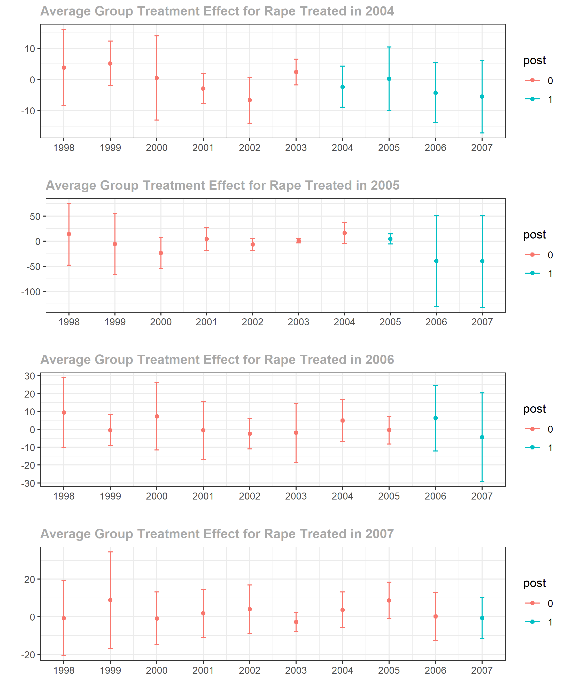
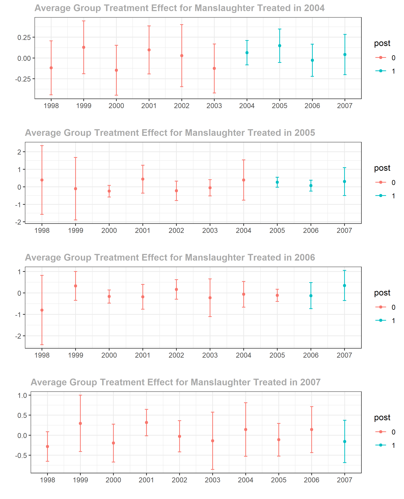
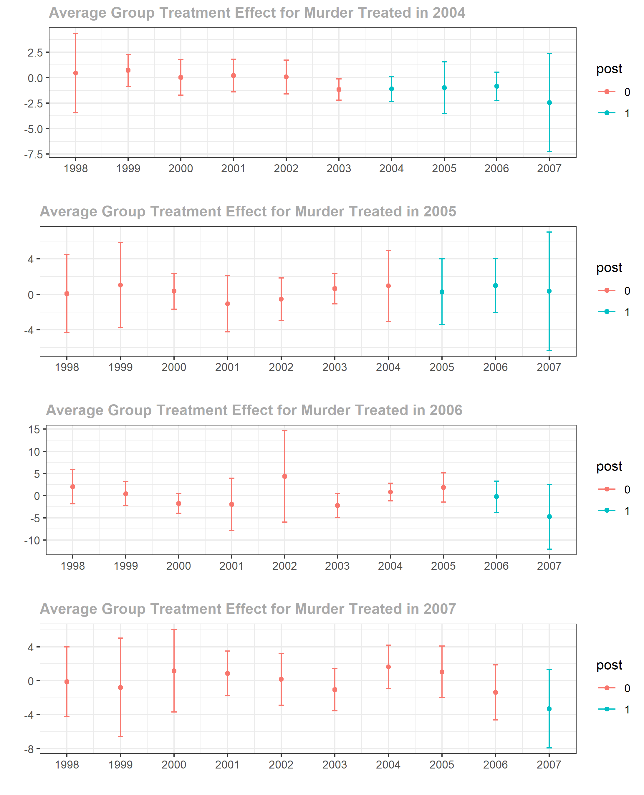

```{r setup, include=FALSE, message=FALSE}
knitr::opts_chunk$set(echo = FALSE, warning = FALSE,message=FALSE)
library(did)
library(haven)
library(dplyr)
library(tidyverse)
library(zoo)
library(lubridate)
library(stats)
library(collapse)
library(xlsx)
library(kableExtra)
library(readxl)
```


  Calls to increase the federal minimum wage to \$15 an hour has gained traction in recent policy debates in the United States, propelled by the fact that the last increase occurred in 2009 to the current \$7.25. Although the minimum wage has no kept up with inflation, the debate revolves around the impact that an increase in the Federal minimum wage will have on employment. Some policy makers believe that there will be a negative short-run and long-run effect, whereas others believe there will only be a negative short-run effect, and some argue that there will be no negative impacts whatsoever. The issue is that, unlike some other policy debates, there is evidence that supports the claims made by both sides. In fact, since Card and Krueger’s (1994) study, there is not even a consensus among economist on how to measure or study the effect of minimum wage increases. Some researchers have only focused on the impact on teen employment (Allegretto et al. 2017, Callaway and Sant’Anna 2020), whereas others have focused only on specific sectors (authors and what not), and others have focused on the overall population (authors and whatnot). 

One of the most interesting arguments supporting the minimum wage increase is that an increase in the minimum wage will lead to a decrease in overall crime rates as claimed by the Council of Economic Advisors (2016). The theory behind the claim is that an increase to the minimum wage will increase the opportunity cost of committing a crime, as the criminal could be earning more by having a minimum wage job that committing crime. Notwithstanding that this argument relies on the fact that there will be no negative effect on employment, the economic theory is intuitive for two reasons. The first is that, since the federal minimum wage has no kept pace with inflation, an increase in wage means that the worker has more disposable income to sustain themselves, thus they do not need to find another source of income, such as committing property crimes, to acquire their necessities, for example diapers. The second reason is that it also increases the cost of crime if the criminal gets caught, as the time they spend in jail/court they could have spent working and earning. However, there are two issues with this argument. The first is that the cost of crime might not have increased, rather it might have decreased. Assuming that there is no loss in employment, its own thorny issue, people’s income have increase, therefore they buy more goods, that they previously could not afford, or they carry more cash on themselves. In either case, people whose minimum wage has increased are now “richer” targets and might offset the increase in cost of committing crime mentioned earlier and even decrease it. The other issue is that an increase in the minimum wage might lead to a decrease in employment thus pushing workers into committing crimes, either due to “teen idleness” or as alternative source of income. Again, just like the literature concerning the impact of minimum wage increases on employment, there is no clear evidence to support or refute the claim that minimum wage increase will decrease crime. Hashimoto (1987) managed to estimate a time series regression and found that increases in the federal minimum wage are positively correlated with property crimes committed by teenagers. Beauchamp and Chan (2014) also found positive evidence of a positive correlation with property and violent crimes committed by teenagers, but there is a negative correlation with young adults. Therefore, just like the literature on minimum wage and employment, there is no clear result. 
 	
By using the Federal Bureau of Investigation’s Uniform Crime Reporting (UCR) program and a new research method developed by Callaway and Sant’Anna (2020), this paper seeks to make contributions to the existing literature on the direct effect of increasing minimum wage on overall crime rates in an attempt to clarify the effects. 


## Describing the Data and Methodology

 

```{r, echo=FALSE, include=FALSE}
# This is the preparation file that imports the cleaned and reduced version of all the datasets, using Stata, of my data 
# ucr_meth <- read_dta("G:/Causal Inference/Data/ucr_meth.dta")
 ucr_meth <- read_dta("C:/Users/gaeta/Documents/GitHub/CausalReasearch/ucr_meth.dta")

UCR <- zap_formats(ucr_meth) #
UCR<- zap_label(UCR) # Need to zap stuff because my data set does not play nice with R

# Dropping the states that were dropped
remove <- c("AL", "AK", "AZ", "AR", "CA", "CT", "DC","DE", "HI", "ME", "MA", "MS", "NH", "NJ", "NY", "OR", "PA", "RI", "VT", "WA", "WY", "KY")
UCR <- UCR[!UCR$stname %in% remove,]
UCR <- UCR[complete.cases(UCR), ] # dropping varables without a name or stateip

UCRQuarter <- UCR %>%
  mutate(Quarter = ceiling(as.numeric(UCR$month) / 3)) # Specifying which quarter the data belongs in accroding to the month

UCRTEST <- collapse::collap(UCRQuarter, ~ stname + year + Quarter) # Aggregating by the state name, the year and quarter 

 # write.xlsx(UCRTEST, file = "G:/Causal Inference/Data/CleanUP1.xlsx") # Exporting the data as an excel spreadsheet so that I can mually add in the First.Treat and treat columns 
write.xlsx(UCRTEST, file = "C:/Users/gaeta/Documents/GitHub/CausalReasearch/CleanUP1.xlsx")


# Read in the modified excel spreadsheet
# CleanUP <- read_excel("G:/Causal Inference/Data/CleanUP.xlsx")
CleanUP <- read_excel("C:/Users/gaeta/Documents/GitHub/CausalReasearch/CleanUP.xlsx")

CleanUPWork <- collap(CleanUP, ~ stname + year, custom = list(fmean= 22, fmean= 1, fsum = 4:21, fsum = 23)) # Collapse data where we are taking the mean of column 1 and 22, representing state id and year, and summing the rest of the rows 

CleanUPWork$treated <- ifelse(CleanUPWork$treated>1,1,0) # need to round the treated column down to 1 if greater than 1 as we want it to be a binary.
```


The primary data source for this paper is the UCR provided by NAME OF PRESON containing the criminal arrest rates by counties in all 50 states plus D.C.  from 1997 to 2007. However, following Callaway and Sant’Anna (2020), I will only be looking at 29 states. The UCR collects the number of offenses that have come to the attention of law enforcement for violent and property crimes, as well as data concerning clearances of theses offenses that is not used in this paper. The FBI defines violent crimes as offenses that involve force or threat of force, whereas property crimes do not. The offenses that I will be paying particular attention to are murder, manslaughter, rape, robbery, burglary, larceny and vehicle theft.
	

  In order to perform the analysis, I will be using the method proposed, and created by, Callaway and Sant’Anna (2020) called the difference-in-difference with multiple time periods, instead of a regular difference-in-difference (DID) method. As I am considering a time period from 1997 to 2007, a period where the federal minimum wage had remained at $5.15 an hour, there have been come states that have increased their minimum wage throughout this period, mostly occurring a couple of years before the 2009 federal minimum increase. The states that have seen an increase in their minimum wage are part of the treated group, whereas the states that have not changed their minimum wage paper are part of the untreated group. The states that have not changed their minimum wage but had a higher state minimum wage have been dropped from the data, thus leaving only 29 states to be observed. The reason that a DID method is not recommended in this case study is because states that have increased their minimum wages have done so at different times. The DID method requires two time periods and two groups –  in period one no one is treated, in period two one group is treated and the other is not – to allow us to estimate the causal effect. The Callaway and Sant’Anna method allows for a difference-in-difference method to be used over multiple treatment time periods. As I am replicating Callaway and Sant’Anna’s paper but focusing only on crime rates, it is important to note that my data set is looking overall crime rates at the state level, not the county level. Based on current literature, and economic theory, I suspect that we will see that there are no statistically significant effect of minimum wage increases on non-financially motivated crimes (rape, manslaughter, murder) and statistically significant positive effects on financially motivated crimes, meaning that crime rates for these types of crimes will increase.

 
## Performing the Analysis

### Non-Financially Motivated Crimes

```{r}
############################## rape
attrape_pc <- att_gt(yname = "rape_pc", # LHS variable
               tname = "year", # time variable
               idname = "statefip", # id variable
               gname = "First.Treat", # first treatment period variable
               data = CleanUPWork, # data
               xformla = NULL, # no covariates
               est_method = "dr", # "dr" is doubly robust. "ipw" is inverse probability weighting. "reg" is regression
               control_group = "nevertreated", # set the comparison group which is either "nevertreated" or "notyettreated" 
               bstrap = TRUE, # if TRUE compute bootstrapped SE
               biters = 1000, # number of bootstrap iterations
               print_details = FALSE,
               clustervars = "statefip", # cluster level
               panel = TRUE) # whether the data is panel or repeated cross-sectional

```
```{r, , out.height = '45%', fig.align='center'}
# Plot group-time ATTs


```

As we can see in the above graph, there is no statistically significant effect of minimum wage increases on the number of rapes per capita. In fact, there are no statistically significant effect on any of the other non-financially motivated crimes, as theorized. These results are rather surprising due to the nature of the crime, they were committed with the intent to harm. The only way for there to be a statistically significant effect is if a significant number of these violent crimes are “escalation of crimes”, meaning that these non-financially motivated crimes started off as financially motivated crimes. For example, a criminal committing a crime of burglary gets startled and accidentally kills the homeowner. He is arrested for, and the crime is reported as, murder. In this scenario, the criminal escalated the criminal act of burglary to murder without intending to do so. Therefore, if there was a significant increase in the number of burglaries and an increase in the number of murders, then it could be theorized that the minimum wage increase has indirectly positively affected the murder rate by increasing the number of burglaries. However, this would be assuming that there is statistically significant effect on both non-financially and financially motivated crimes. For now, the only conclusion that can be made is that increases to the minimum wage does not affect non-financially motivated crimes.  

  In contrast to the lack of statically significant effects on non-financially motivated crimes, there is some evidence of positive effects of increases of the minimum wage on financially motivated crimes. As shown in the plots below, larceny has two group-time average treatment effects that are statistically different from 0, whereas vehicle theft, burglary and robbery have one.  This seems to provide evidence refuting the claim that increases to the minimum wage will decrease crime by increasing its opportunity cost. However, it is unclear from the plots whether this is due to the victims are considered “wealthier” or if the criminals were pushed into committing crimes due to a loss of employment. What is interesting is that the small number of  group-time average treatment effects that are statistically different from 0 seems to suggest that the aggregated group-time average treatment effects are going to be statistically insignificant. 


```{r, fig.align='center'}
# Event-study
agg_effects_es <- aggte(attrape_pc, type = "dynamic", na.rm = TRUE)
rape <- cbind(c(round(agg_effects_es$overall.att, digits = 3), "(-9.37, 2.67)"))

```

```{r}

############################## larceny
attlarceny_pc <- att_gt(yname = "larceny_pc", # LHS variable
                  tname = "year", # time variable
                  idname = "statefip", # id variable
                  gname = "First.Treat", # first treatment period variable
                  data = CleanUPWork, # data
                  xformla = NULL, # no covariates
                  #xformla = ~ l_police, # with covariates
                  est_method = "dr", # "dr" is doubly robust. "ipw" is inverse probability weighting. "reg" is regression
                  control_group = "nevertreated", # set the comparison group which is either "nevertreated" or "notyettreated" 
                  bstrap = TRUE, # if TRUE compute bootstrapped SE
                  biters = 1000, # number of bootstrap iterations
                  print_details = FALSE,
                  clustervars = "statefip", # cluster level
                  panel = TRUE) # whether the data is panel or repeated cross-sectional

```

```{r, fig.align='default', out.height= '40%', out.width='50%'}
# Plot group-time ATTs
knitr::include_graphics(c("attlarceny_pc.png","attvehicle_pc.png"))
```

```{r, fig.align='default', out.height= '40%', out.width='50%'}
# Plot group-time ATTs
knitr::include_graphics(c("attrobbery_pc.png","attburglary_pc.png"))
```


```{r}
# Event-study you want this 
agg_effects_es1 <- aggte(attlarceny_pc, type = "dynamic", na.rm = TRUE)

larceny <- cbind(c(round(agg_effects_es1$overall.att, digits = 3), "(14.11, 227.28)*"))
# Plot event-study coefficients
ggdid(agg_effects_es1)                

```

```{r}
############################## vehicle
attvehicle_pc <- att_gt(yname = "vehicle_pc", # LHS variable
                        tname = "year", # time variable
                        idname = "statefip", # id variable
                        gname = "First.Treat", # first treatment period variable
                        data = CleanUPWork, # data
                        xformla = NULL, # no covariates
                        #xformla = ~ l_police, # with covariates
                        est_method = "dr", # "dr" is doubly robust. "ipw" is inverse probability weighting. "reg" is regression
                        control_group = "nevertreated", # set the comparison group which is either "nevertreated" or "notyettreated" 
                        bstrap = TRUE, # if TRUE compute bootstrapped SE
                        biters = 1000, # number of bootstrap iterations
                        print_details = FALSE,
                        clustervars = "statefip", # cluster level
                        panel = TRUE) # whether the data is panel or repeated cross-sectional

```


```{r}
# Event-study you want this 
agg_effects_es2 <- aggte(attvehicle_pc, type = "dynamic", na.rm = TRUE)
vehicle <- cbind(c(round(agg_effects_es2$overall.att, digits = 3), "(-165.03, 354.94)"))

```

```{r}
############################## burglary
attburglary_pc <- att_gt(yname = "burglary_pc", # LHS variable
                        tname = "year", # time variable
                        idname = "statefip", # id variable
                        gname = "First.Treat", # first treatment period variable
                        data = CleanUPWork, # data
                        xformla = NULL, # no covariates
                        #xformla = ~ l_police, # with covariates
                        est_method = "dr", # "dr" is doubly robust. "ipw" is inverse probability weighting. "reg" is regression
                        control_group = "nevertreated", # set the comparison group which is either "nevertreated" or "notyettreated" 
                        bstrap = TRUE, # if TRUE compute bootstrapped SE
                        biters = 1000, # number of bootstrap iterations
                        print_details = FALSE,
                        clustervars = "statefip", # cluster level
                        panel = TRUE) # whether the data is panel or repeated cross-sectional
```


```{r}
# Event-study you want this 
agg_effects_es3 <- aggte(attburglary_pc, type = "dynamic", na.rm = TRUE)
burglary <- cbind(c(round(agg_effects_es3$overall.att, digits = 3), "(-37.72, 67.14)"))

```

```{r}

############################## manslaughter
attmanslaughter_pc <- att_gt(yname = "manslaughter_pc", # LHS variable
                         tname = "year", # time variable
                         idname = "statefip", # id variable
                         gname = "First.Treat", # first treatment period variable
                         data = CleanUPWork, # data
                         xformla = NULL, # no covariates
                         #xformla = ~ l_police, # with covariates
                         est_method = "dr", # "dr" is doubly robust. "ipw" is inverse probability weighting. "reg" is regression
                         control_group = "nevertreated", # set the comparison group which is either "nevertreated" or "notyettreated" 
                         bstrap = TRUE, # if TRUE compute bootstrapped SE
                         biters = 1000, # number of bootstrap iterations
                         print_details = FALSE,
                         clustervars = "statefip", # cluster level
                         panel = TRUE) # whether the data is panel or repeated cross-sectional
```


```{r}
# Event-study you want this 
agg_effects_es4 <- aggte(attmanslaughter_pc, type = "dynamic", na.rm = TRUE)
manslaughter <- cbind(c(round(agg_effects_es4$overall.att, digits = 3), "(-0.024, 0.076)"))

```

```{r}

############################## robbery
attrobbery_pc <- att_gt(yname = "robbery_pc", # LHS variable
                             tname = "year", # time variable
                             idname = "statefip", # id variable
                             gname = "First.Treat", # first treatment period variable
                             data = CleanUPWork, # data
                             xformla = NULL, # no covariates
                             #xformla = ~ l_police, # with covariates
                             est_method = "dr", # "dr" is doubly robust. "ipw" is inverse probability weighting. "reg" is regression
                             control_group = "nevertreated", # set the comparison group which is either "nevertreated" or "notyettreated" 
                             bstrap = TRUE, # if TRUE compute bootstrapped SE
                             biters = 1000, # number of bootstrap iterations
                             print_details = FALSE,
                             clustervars = "statefip", # cluster level
                             panel = TRUE) # whether the data is panel or repeated cross-sectional
```


```{r}
# Event-study you want this 
agg_effects_es5 <- aggte(attrobbery_pc, type = "dynamic", na.rm = TRUE)
robbery <- cbind(c(round(agg_effects_es4$overall.att, digits = 3), "(-4.37, 13.57)"))

```

```{r}

############################## murder
attmurder_pc<- att_gt(yname = "murder_pc", # LHS variable
                        tname = "year", # time variable
                        idname = "statefip", # id variable
                        gname = "First.Treat", # first treatment period variable
                        data = CleanUPWork, # data
                        xformla = NULL, # no covariates
                        #xformla = ~ l_police, # with covariates
                        est_method = "dr", # "dr" is doubly robust. "ipw" is inverse probability weighting. "reg" is regression
                        control_group = "nevertreated", # set the comparison group which is either "nevertreated" or "notyettreated" 
                        bstrap = TRUE, # if TRUE compute bootstrapped SE
                        biters = 1000, # number of bootstrap iterations
                        print_details = FALSE,
                        clustervars = "statefip", # cluster level
                        panel = TRUE) # whether the data is panel or repeated cross-sectional
```


```{r}
# Event-study you want this 
agg_effects_es6 <- aggte(attmurder_pc, type = "dynamic", na.rm = TRUE)
murder <- cbind(c(round(agg_effects_es6$overall.att, digits = 3), "(-1.05,0.31)"))

Description <- rbind("Overall ATT", "95% CI")
Table <- cbind(Description,Murder = c(murder), Manslaughter = c(manslaughter), Rape = c(rape), Vehicle = c(vehicle), Robbery = c(robbery), Larceny = c(larceny), Burglary = c(burglary))


kbl(Table,format = "latex", caption = "Minimum Wage Aggreagted Treatment Effect Estimates", booktabs =T)%>%
add_header_above(c(" ","Violent Crimes"=3,"Non-Violent Crimes"=4))  %>%
  kable_styling(latex_options =c("striped", "scale_down")) %>%
  row_spec(0:2,align = "c")


```


## Appendix

```{r, out.height = '80%' , fig.align='center'}
# Plot group-time ATTs


```

```{r, out.height = '80%' , fig.align='center'}
# Plot group-time ATTs


```